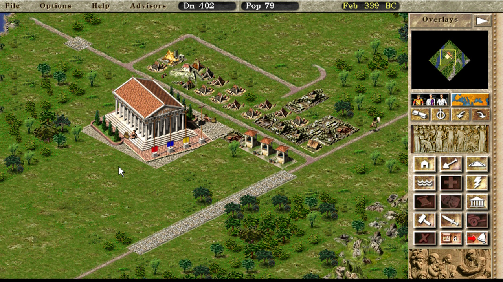

Overview
=====
This is my Switch port of Julius, a Caesar III re-implementation), based on devnoname120's Vita port.

Julius is an open source re-implementation of Caesar III.

The aim of this project is to create an open-source version of Caesar 3, with the same logic as the original, but with some UI enhancements, that is able to be played on multiple platforms. The same logic means that the saved games are 100% compatible, and any gameplay bugs present in the original Caesar 3 game will also be present in Julius.



UI enhancements include:
- Support for widescreen resolutions
- Windowed mode support for 32-bit desktops

Julius requires the original assets (graphics, sounds, etc) from Caesar 3 to run.

Thanks
======
Thanks to my supporters on Patreon: Andyways, CountDuckula, Greg Gibson, Jesse Harlin, Özgür Karter, Matthew Machnee, and RadicalR.

Thanks to the many developers of the game, such as Bianca van Schaik, crudelius, and all the others who were involved in creating this game.

Thanks to @devnoname120 for porting the game to the Vita.

Installation Instructions
=====
- Extract the contents of julius_switch.zip into the `switch` folder on your SD card, so that you have a folder `switch/julius` with `julius.nro` inside.

- Copy all the files from a Caesar 3 install into the `switch/julius` folder on you SD card, so that you have the file `c3.eng` and more in your folder, in addition to `julius.nro`. Caesar 3 can be purchased from gog.com for example.

Switch-exclusive Features
=====
- USB mouse and keyboard support
- Left analog stick mouse control
- Right analog stick map scrolling
- Touchpad-style mouse controls with click gestures (short single tap for left click etc.)
- On-Screen keyboard via plus-key, useful to enter player name

Controls
=====
Left analog stick = move the mouse pointer
Right analog stick or dpad up/down/left/right = Move the map.
R / A = left mouse button
L / B = right mouse button
ZR = hold to slow down analog stick mouse pointer
ZL = hold to speed up analog stick mouse pointer
X = Simulate `Pg. Up` keypress (speed up in-game time)
Y = Simulate `Pg. Down` keypress (slow down in-game time)
Plus = Bring up on-screen keyboard, useful to enter player name etc.
Select = Toggle between direct touch mode (pointer jumps to finger, nothing else) and touchpad mode (drag pointer with finger, tap for single clicks etc.)

Touch controls
======
Note: for multi-touch gestures, the fingers have to be far enough apart from each other, so that the Vita will not erroneously recognize them as a single finger. Otherwise the pointer will jump around. 

Single short tap = left mouse click  
Single short tap while holding a second finger down = right mouse click  
Single finger drag = move the mouse pointer, how far the pointer moves in response to finger motion depends on the Mouse Speed setting  
Dual finger drag = drag'n'drop (left mouse button is held down)  
Three finger drag = drag'n'drop (right mouse button is held down)  

Build Instructions
=====
````
cmake -DSWITCH_BUILD=ON -DCMAKE_BUILD_TYPE=Release ../julius
make julius_switch.zip -j12
````

Changelog
=====
v1.02
- Compile with latest source, should hopefully fix crashes with video playback
- Hold ZR/ZL for slow/fast mouse, useful for precise pointer control with left analog stick
- Implement direct touch mode where pointer jumps to finger directly (press minus to toggle)

v1.01

- First release on Switch